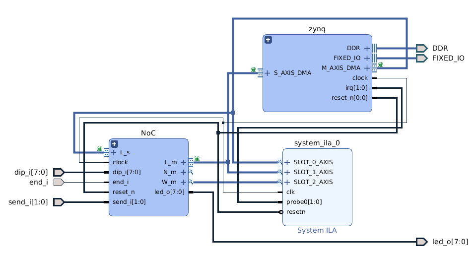
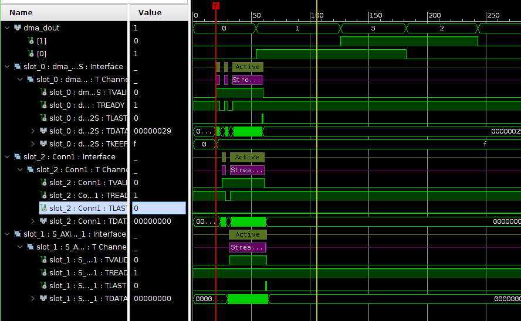

# Zynq PS and Hermes

This repo contains scripts to recreate a Vivado and xSDK project Zynq PS connected to a [Hermes network-on-chip router](https://www.sciencedirect.com/science/article/abs/pii/S0167926004000185) via AXI streaming interface. The project is setup for Zedboard, although it would be easy to change to other boards assuming you have some basic TCL skills.

# The module design




The following ILA's waveform shows the design working in the FPGA running the application *dma_test* or *dma_test_int*. This application sends a packet with 

```
u32 hermes_pkg[] = {0x0001,0x0001,0x0003};
```

This corresponds to a loopback via ARM => DMA => R11 => R01 => DMA => ARM.
Any packet sent to address 0x0001 will perform the same loopback behavior.

This design connects the master port of the AXI DMA to the slave port of an Hermes router of address 0x11 (slot 0). The packet is directed to a neighbor router of address 0x01 (slot1), and finally, the master local port of router 0x01 sends the packet back to the ARM via DMA slave interface.



This design uses Zedboard's buttons, dip switches, and LEDs for testing the router. Please read the comments on hw/xdc/const.xdc to see how to interact with the design. If you have other board rather than zed, just remap these ports to your own board.

# Applications

 - dma_test: sends a loopback packet via ARM => DMA => R11 => R01 => DMA => ARM. DMA is using polling mode;
- dma_test_int: sends a loopback packet via ARM => DMA => R11 => R01 => DMA => ARM. DMA is using interruption mode;
- xaxidma_example_simple_intr: DMA testing [example](https://github.com/Xilinx/embeddedsw/blob/master/XilinxProcessorIPLib/drivers/axidma/examples/xaxidma_example_simple_intr.c) based in interruption.

# How to download it

This repository has custom IPs included as git submodules. Thus, the following command is required to download all its depedencies.

```
git clone --recursive https://github.com/amamory/zynq-ps-hermes-noc.git
```

If you alread cloned the repository without `--recursive`, then run the following command to download all the submodules.

```
git submodule update --init --recursive
```

Refer to this [tutorial](https://www.vogella.com/tutorials/GitSubmodules/article.html) to learn how to manage submodules.

# How to run it

These scripts are assuming Linux operation system (Ubuntu 18.04) and Vivado 2018.2.

Follow these instructions to recreate the Vivado and SDK projects:
 - Open the **build.sh** script and edit the first two lines to setup the environment variables:
    - **VIVADO**: path to the Vivado install dir;
    - **VIVADO_DESIGN_NAME**: mandatory name of the design
    - **XIL_APP_NAME**: used only in projects with software. Not used in this design; 
    - **VIVADO_TOP_NAME**: set the top name (optional).  
 - run *build.sh*

These scripts will recreate the entire Vivado project, compile the design, generate the bitstream, export the hardware to SDK, create the SDK projects, import the source files, build all projects, and finally download both the bitstream and the elf application. Hopefully, all these steps will be executed automatically.

# How to update the submodules

This design uses custom IPs that are git submodules. These IPs might get updated over time. If you wish to get the latest IP version, then execute these commands:

```
git submodule update --init --recursive
git submodule foreach git pull origin master
```

# How to update the scripts

These scripts come from a template repository and they get updated and improved over time. If you wish to get the latest script version, then follow these steps:

```
git remote add template https://github.com/amamory/vivado-base-project.git
git fetch --all
git merge --no-commit --no-ff template/master --allow-unrelated-histories
```

Solve any conflict manually and then commit.

# Future work

 - update the scripts to Vitis
 - make the script more generic, for example, board independent
 - support or test with Windows (help required !!! :D )

# Credits

The scripts are based on the excellent scripts from [fpgadesigner](https://github.com/fpgadeveloper/zedboard-axi-dma) plus few increments from my own such as project generalization, support to SDK project creation and compilation and other minor improvements. 
